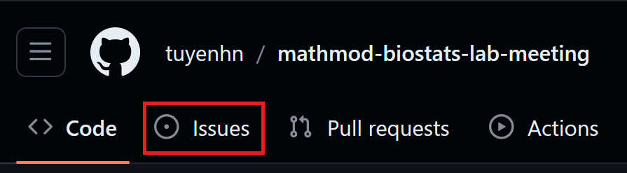
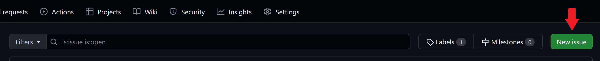
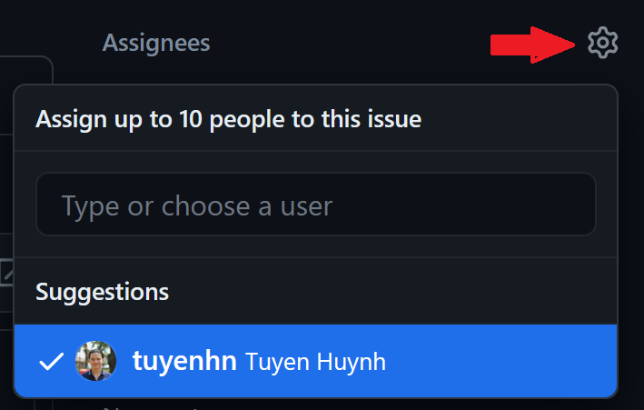
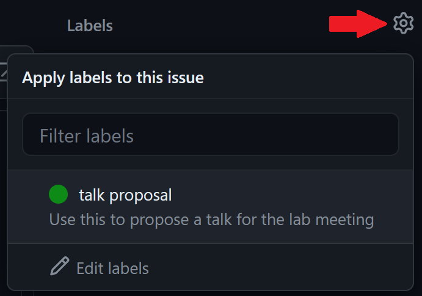

# OUCRU's Mathematical Modelling & Biostatistics lab meeting

- _Time_: Tuesdays, 2-3pm
- _Frequency_: Biweekly, extra meetings can be added inbetween
- _Location_: Room 309 (subject to change depending on vacancy) / Zoom

## 2024 schedule

| Date       | Title                                                  | Presenter        |
| :--------- | :----------------------------------------------------- | :--------------- |
| 12/03/2024 | Health Economics Evaluation for Hepatitis C in Vietnam | Huyen Nguyen Anh |
| 26/03/2024 | Dengue forecasting with out-of-time cross-validation               | Tuyen Huynh      |

## Usage instruction

To propose/add a talk to the schedule:

- Create a new issue

- Add talk to title as issue title
- Add proposed date and presenter name in the description

- (optional) Add other relevant information in the description, e.g. read paper beforehand(?)
- Add Tuyen as the assignee

- Label the issue as "talk proposal"

- Hit "Submit new issue"
