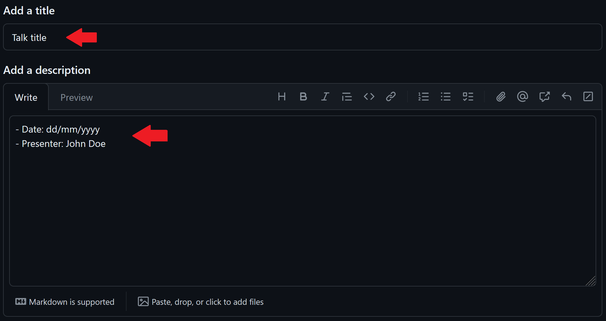

# OUCRU's Mathematical Modelling & Biostatistics lab meeting

- _Time_: Tuesdays, 2-3pm
- _Frequency_: Biweekly, extra meetings can be added inbetween
- _Location_: Room 309 (subject to change depending on vacancy) and [Zoom](https://zoom.us/j/97208653692?pwd=UHR3bFhuejZrTERNS0FYUGZ0NkFCdz09)
- _Coordinator_: Tuyen (<tuyenhn@oucru.org>)

## 2024 schedule

| Status | Date       | Title                                                                                                            | Presenter                      | Organisation           | Location |
| :----: | :--------- | :--------------------------------------------------------------------------------------------------------------- | :----------------------------- | :--------------------- | :------- |
|  🔴   | 12/03/2024 | Health Economics Evaluation for Hepatitis C in Vietnam                                                           | Huyen Nguyen Anh               | Modelling group, OUCRU | R309     |
|  🟢   | 26/03/2024 | Dengue forecast modelling and evaluation framework in Ho Chi Minh City                                           | Tuyen Huynh                    | Modelling group, OUCRU | R309     |
|  🟡   | 02/04/2024 | The impact of national and international travel on spatio-temporal transmission of SARS-CoV-2 in Belgium in 2021 | Minh Hanh Nguyen, Trang Nguyen | Hasselt University     | TBA      |

Status indicators:

- 🟢: Current/Upcoming talk
- 🟡: Scheduled talk(s)
- 🔴: Past talks

## Usage instruction

To propose/add a talk to the schedule:

- Create a new issue

- Add talk to title as issue title
- Add proposed date and presenter name in the description

- (optional) Add other relevant information in the description, e.g. read paper beforehand(?)
- Add Tuyen as the assignee

- Label the issue as "talk proposal"

- Hit "Submit new issue"
